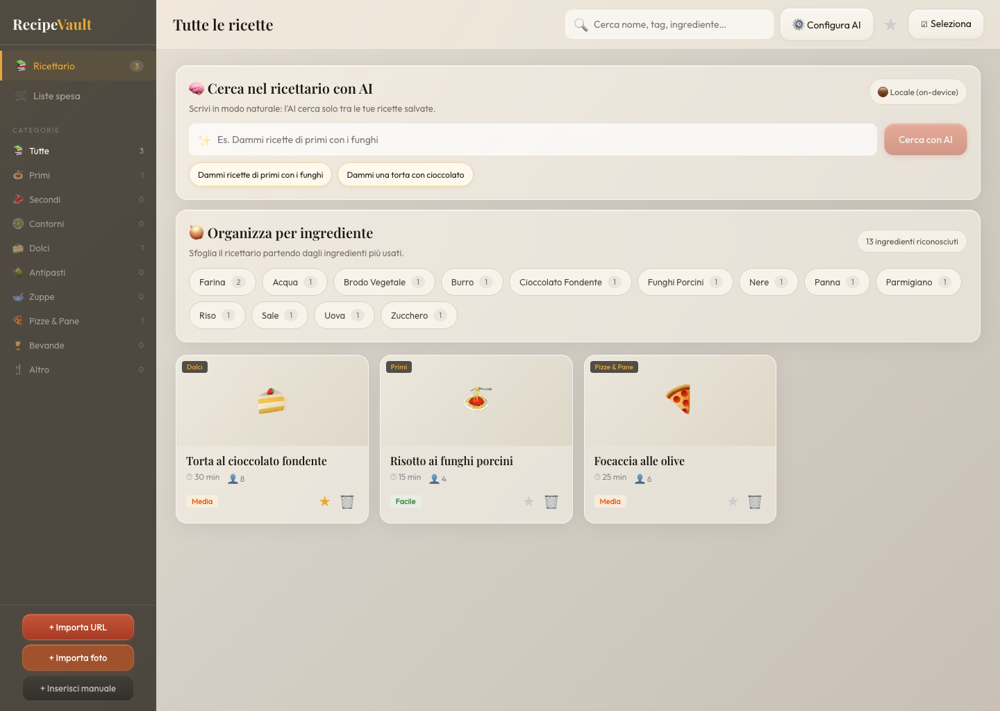
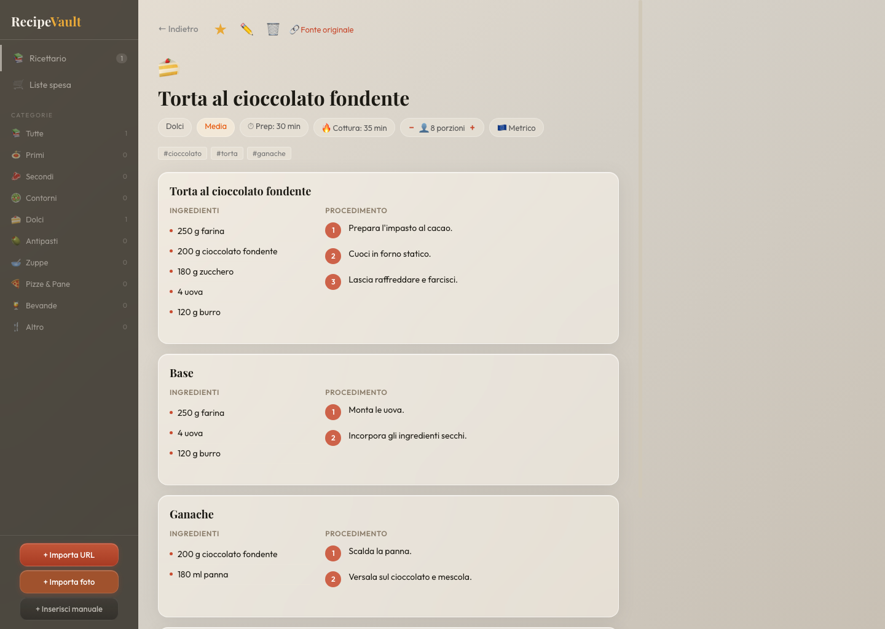
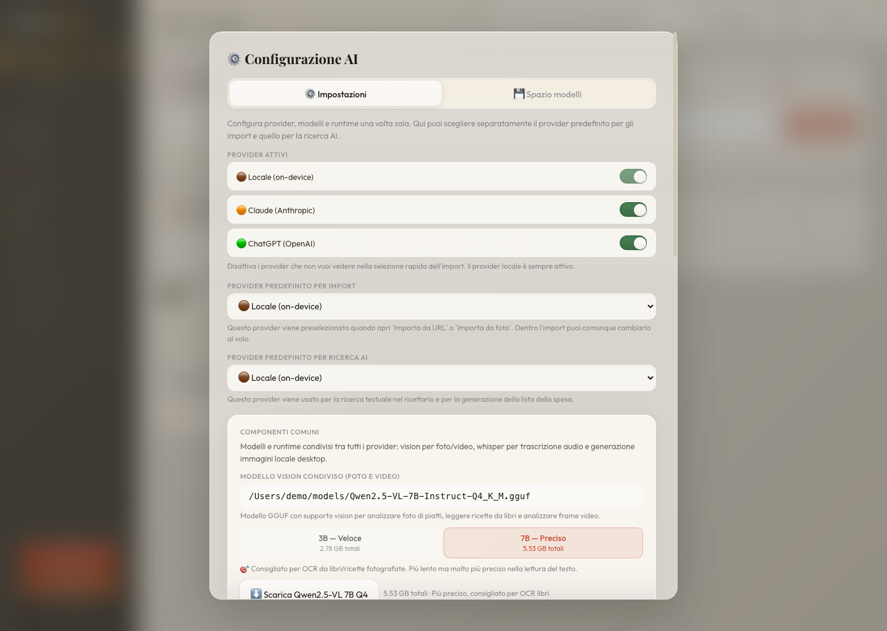

# 🍽 RecipeVault — App Desktop (Tauri + React)

Gestore ricette standalone per macOS con import AI da qualsiasi fonte.

---

## 🖼 Screenshot desktop

### Libreria ricette


### Dettaglio ricetta


### Configurazione AI


---

## ✅ Prerequisiti (installare una volta sola)

### 1. Xcode Command Line Tools
```bash
xcode-select --install
```

### 2. Homebrew (se non ce l'hai)
```bash
/bin/bash -c "$(curl -fsSL https://raw.githubusercontent.com/Homebrew/install/HEAD/install.sh)"
```

### 3. Rust
```bash
curl --proto '=https' --tlsv1.2 -sSf https://sh.rustup.rs | sh
source "$HOME/.cargo/env"
```

### 4. Node.js (v18+)
```bash
brew install node
```

---

## 🚀 Primo avvio (sviluppo)

```bash
# Entra nella cartella del progetto
cd recipevault

# Installa le dipendenze JavaScript
npm install

# Avvia in modalità sviluppo (apre la finestra dell'app)
npm run tauri:dev
```

Al primo avvio Rust compila il backend (~2-3 minuti). I successivi saranno molto più veloci.

---

## 📦 Build finale (app distribuibile)

```bash
npm run tauri:build
```

Trovi il file `.app` in:
```
src-tauri/target/release/bundle/macos/RecipeVault.app
```

Trascinalo in `/Applications` per installarlo come qualsiasi altra app Mac.

### Build per Intel (`x86_64`)

Se vuoi generare una build compatibile con Mac Intel:

```bash
rustup target add x86_64-apple-darwin
npm run tauri:build:x64
```

Output atteso:
```bash
src-tauri/target/x86_64-apple-darwin/release/bundle/macos/RecipeVault.app
```

### Build universale (`arm64` + `x86_64`)

Se vuoi un `.app` unico che giri sia su Apple Silicon sia su Intel:

```bash
rustup target add x86_64-apple-darwin
npm run tauri:build:universal
```

Output atteso:
```bash
src-tauri/target/universal-apple-darwin/release/bundle/macos/RecipeVault.app
```

---

## 🤖 Versione Android Studio

Nel repo trovi anche una versione Android apribile direttamente in Android Studio:

```text
recipevault/android-studio
```

Per aggiornare gli asset web usati dalla `WebView` Android:

```bash
npm run android:web
```

I dettagli di apertura/build sono nel file:

```text
android-studio/README.md
```

---

## 🔑 Configurazione API Key

Al primo avvio l'app ti chiede di scegliere il provider AI:

| Provider | Dove ottenere la chiave | Prefisso |
|---|---|---|
| **Claude (Anthropic)** | https://console.anthropic.com | `sk-ant-...` |
| **ChatGPT (OpenAI)** | https://platform.openai.com/api-keys | `sk-proj-...` |

La chiave viene salvata solo in `localStorage` del tuo Mac, mai inviata altrove.

---

## 🤖 Differenze tra i provider AI

| Funzione | Claude | OpenAI |
|---|---|---|
| Import da siti web | ✅ `claude-sonnet` + web_search | ✅ `gpt-4o-search-preview` |
| Import da YouTube | ✅ Ottimo | ✅ Ottimo |
| Import da TikTok/Instagram | ✅ Con didascalia | ✅ Con didascalia |
| Lista spesa AI | ✅ claude-sonnet | ✅ gpt-4o |
| Modelli disponibili | Sonnet 4, Opus 4, Haiku | gpt-4o, gpt-4o-mini, gpt-4-turbo |

Puoi cambiare provider in qualsiasi momento da ⚙ Impostazioni AI nella sidebar.

---

## 💾 Dati e backup

- Le ricette sono salvate in `localStorage` (persistente tra riavvii)
- Usa **Export JSON** per fare un backup o spostare le ricette
- Usa **Import JSON** per ripristinare un backup

---

## 📁 Struttura del progetto

```
recipevault/
├── src/
│   ├── main.jsx          # Entry point React
│   ├── App.jsx           # App completa (AI, UI, storage)
│   └── index.css         # Stili globali
├── src-tauri/
│   ├── src/main.rs       # Backend Rust (minimale)
│   ├── Cargo.toml        # Dipendenze Rust
│   ├── build.rs          # Script build Tauri
│   └── tauri.conf.json   # Config Tauri (finestra, CSP, allowlist)
├── index.html            # Entry HTML
├── vite.config.js        # Config Vite bundler
└── package.json          # Dipendenze Node
```

---

## 🐛 Problemi comuni

**"command not found: cargo"**
```bash
source "$HOME/.cargo/env"
```

**Errore compilazione Rust alla prima build**
Normale, aspetta che finisca (~3-5 min). Non interrompere.

**Finestra bianca all'avvio**
Assicurati che `npm run dev` stia girando su porta 5173 prima di `npm run tauri:dev`.

**Errore `target x86_64-apple-darwin not installed`**
```bash
rustup target add x86_64-apple-darwin
```

**Errore API "invalid_api_key"**
Controlla che la chiave non abbia spazi e che corrisponda al provider selezionato.

---

## 🔄 Aggiornamenti futuri

Per aggiornare l'app dopo modifiche al codice:
```bash
npm run tauri:build
```
E sostituisci il `.app` in `/Applications`.
